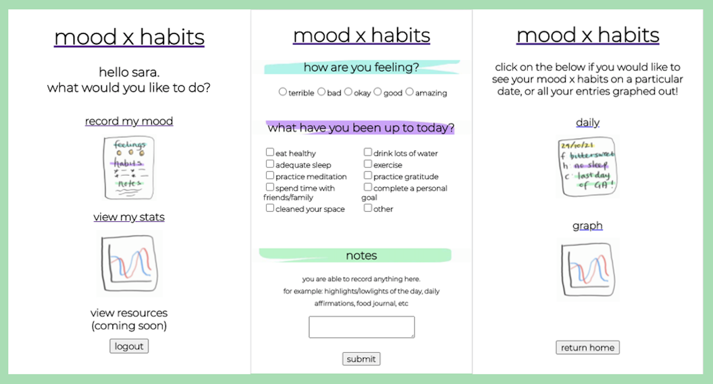
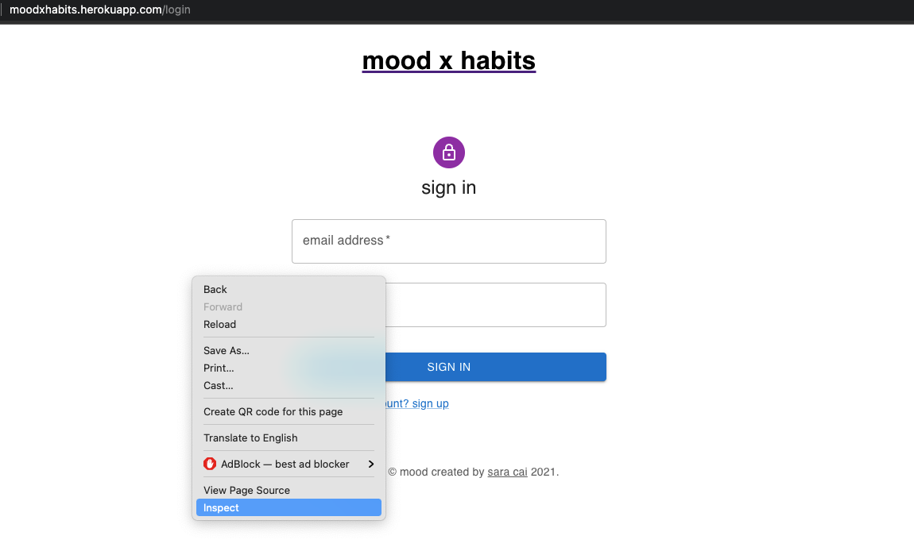
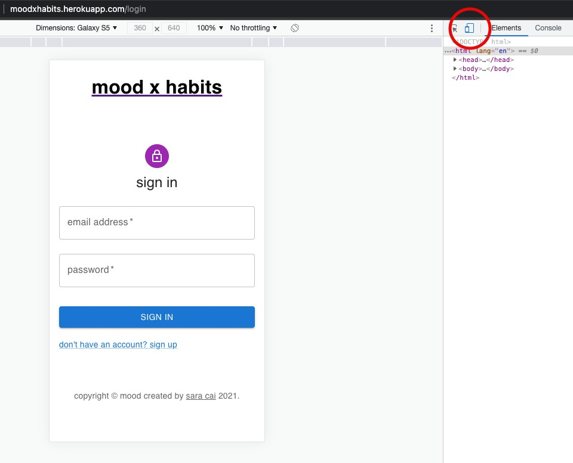

# mood x habits - back-end
View the code for my front-end here: https://github.com/c-sara/moodxhabits-front-end

## Accessing the site
Access the app here: http://moodxhabits.herokuapp.com/login

Please note that the mood x habits app is best in mobile mode, as the desktop mode is still in production.

To change to mobile view:

Step 1: Right click on the browser and select 'inspect'

Step 2: Change the icon from desktop to mobile view, circled below

## Features
mood x habits is a full stack application that allows its users to create and read their daily inputs

The features include:
* Sign up/log in functionality with encrypted passwords and an authorisation flow
    * Users are only allowed into the site if they have an account
    * A database is used to store user information - passwords are encrypted once users have signed up
* RESTful routes used
* Users have the ability to do the following:
    * Record daily posts regarding their mood, habits and notes for the day
    * Reflect back on previous posts they have recorded by selecting a specific date
    * View their stats graphed out on a line chart that compares the user's mood and the number of habits they have accomplished over time

## Technologies used
### Front end
* JavaScript, HTML and CSS
* React.js
  * Including: React Router DOM and React Chart.js 2
* Axios
* MUI

### Back end
* JavaScript
* SQL and PostgreSQL
* Express
  * Including: Express Sessions
* BCrypt

## Approach taken
### Planning
For my frontend, I drew up a [wireframe](https://lucid.app/lucidspark/9149a810-a7e5-4582-bd92-37838bd80002/edit?viewport_loc=-3168%2C-1924%2C8160%2C5052%2C0_0&invitationId=inv_3f61ea76-2e0d-4bd0-9758-25c32120794c) of how I wanted my app to look, and how the pages would flow. This gave me a clear indication on what pages need to be worked on. During the process of coding, my final design did change from the original. It was simplier and more efficient to have the mood, habits and notes completed on one page rather than multiple.

For my backend, I used dbdiagram to plan out the [tables](https://dbdiagram.io/d/617633496239e14647807484) I would need in the database. It was helpful to have this table, as it made it clear what information needed to be inserted into the database from the front end.

### Lessons learnt
* To plan and revist the plan frequently to make sure you are on track or if things need to be revised
* There is a lot that goes into a full stack application and that it can be a lot to do in 4 days
* A lot of learning is done when you are working on a project
  * I learnt more about React, how to use component libraries like MUI and familiarised myself with other technologies I have used in the past (e.g. Axios and Express)

## Future improvements
As there were time constraints with the project, I was not able to deliver everything I would have liked to with my app.

In the future, I would like to add/improve the following:
* When selecting a date in the daily stats section, I would love the calendar to be able to disable dates without a daily entry. Alternatively it could highlight the dates with an entry
* The graph to be updated so it can be clearer when showing the period of time on the x-axis. Currently it is displayed by date in the DD/MM/YYYY format for each point, but I would love for it to be less cluttered when more dates are added (i.e shows months rather than each individual date when there are more entries)
* Add in a resources sections where users are able to find resources for positive news sites, meditation apps, meal ideas, etc